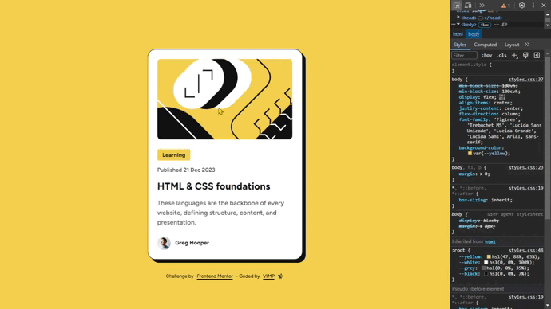
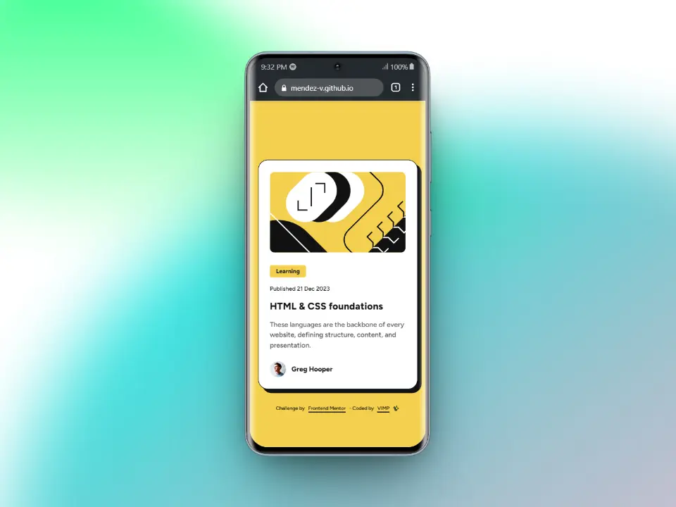
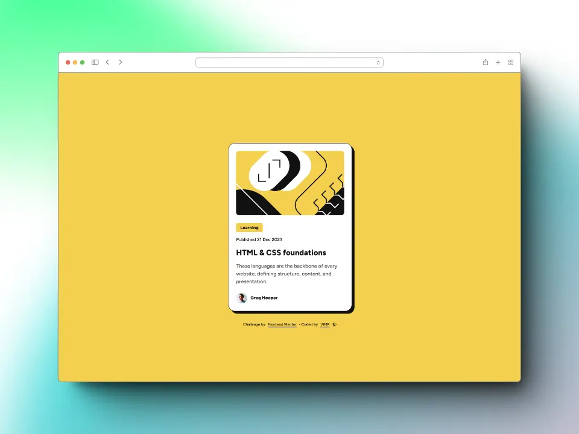

# Frontend Mentor - Blog preview card solution

This is a solution to the [Blog preview card challenge on Frontend Mentor](https://www.frontendmentor.io/challenges/blog-preview-card-ckPaj01IcS).

Frontend Mentor challenges help you improve your coding skills by building realistic projects.

### Table of contents

- [The challenge](#the-challenge)
- [Screenshot](#screenshot)
- [Links](#links)
- [Built with](#built-with)
- [Author](#author)

## The challenge

Users should be able to:

🎯 See hover and focus states for all interactive elements on the page

## Screenshot
### 📱 Mobile

### 💻 Desktop

## Links

[Live Site](https://mendez-v.github.io/blog-preview-card/) 👀

[Solution in Frontend Mentor](https://www.frontendmentor.io/solutions/blog-preview-card-V-XVgKbMXL) 👀

[Challenge Repository](https://github.com/mendez-v/frontend-mentor-challenges) 👀

## Built with

📌 Semantic HTML5 markup

📌 Mobile-first workflow

📌 Utility classes

📌 CSS custom properties

📌 Flexbox

## Author

✨ Frontend Mentor - [@mendez-v](https://www.frontendmentor.io/profile/mendez-v)
